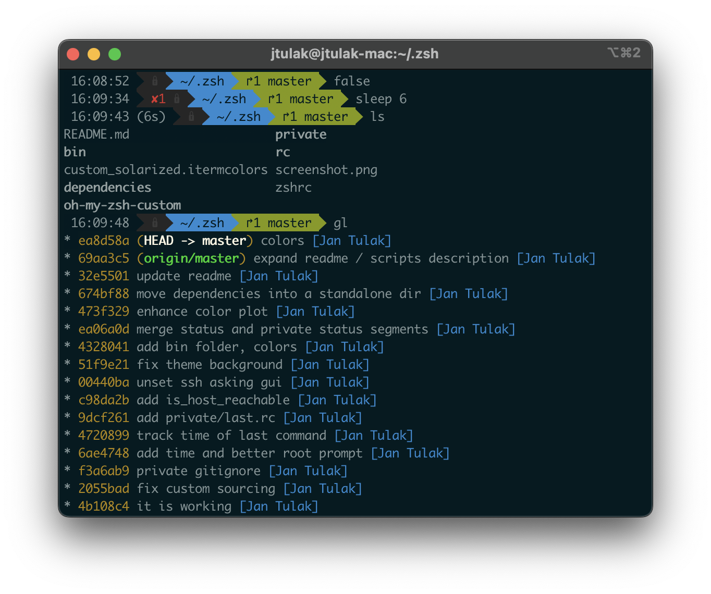

My ZSH config
===============
This config is a preconfigured package with [Oh My Zsh](https://ohmyz.sh), with a modified Agnoster theme.



Installation
------------
There are some dependencies, all are packed in, but need to be installed:
 
 - powerline fonts (`cd powerline-fonts; ./install.sh`)
 - solarized color theme for terminal - just a soft dependency, iterm2 already has it as a built-in optino

 To use this config, install the dependencies and then:
 
```
git clone git@github.com:jtulak/zshrc.git $HOME/.zsh
mv .zshrc .zshrc.backup
ln -s $HOME/.zsh/zshrc $HOME/.zshrc
```

Description
------------
How it differs from a plain oh-my-zsh + Agnoster
- display time
    - when you run a command, the last prompt will update its time to `now` 
    - if a command runs more than a few seconds, its duration will be printed out in the following prompt
- slightly modified git status, to be more verbose about local/remote differences
- easily extendable status segment
    - create `/private/agnoster_private_status.zsh` and everything that this script prints out will be added to the dark segment right after time
- useful scripts
    - `show_all_colors` will print a table of available colors, so you can use it to tune the colors to your taste
    - `is_host_reachable` checks with ping the availability of a hostname, prints it out nicely and returns an appropriate exit code
    - `gl` is an `git log` wrapper
    - Aliases are in `/rc/alias.rc`


Directories and paths
---------------------
All settings put into `/private/` directory are ignored by git and can be used stuff that should not be published, be it passwords (plaintext is bad) or proprietary stuff. `/private/private.rc` file is sourced automatically, so you can link everything from it.

The directories `/bin/` and `/private/bin/` are included in `$PATH`.

You can even global `.gitconfig` if you link it with `/rc/gitconfig` and it will be extended with `/private/gitconfig`

In general, if a file has `.rc` suffix, it's intended to be sourced. If `.zsh` or something else, it's runnable file or some other config.