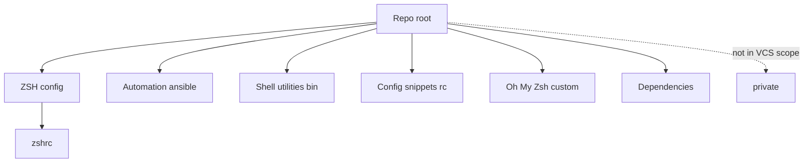

# Repository overview and map

This repository contains a portable ZSH environment tailored for macOS and Linux, using oh-my-zsh with an enhanced Agnoster-derived theme and layered configuration.

Key anchors
- Main config: [zshrc](zshrc:1)
- Multiplexer: [tmux.conf](tmux.conf)
- Automation: [ansible/](ansible/)
- Utilities: [bin/](bin/)
- Config snippets: [rc/](rc/)
- Oh My Zsh customizations: [oh-my-zsh-custom/](oh-my-zsh-custom/)
- Bootstrap helpers: [install_ansible.sh](install_ansible.sh), [install_for_root.sh](install_for_root.sh)
- Not in VCS scope: [private/](private/)

Notes on boundaries
- Content in [private/](private/) is intentionally excluded from VCS and from this memory bank. The main configuration files may optionally source private-local overrides, but these should not be documented here beyond their existence.

High-level map

Directory purposes
- [ansible/](ansible/): Playbooks and roles to bootstrap or update a host and optionally upload configuration; designed for idempotence. See [memory/ansible.md](memory/ansible.md).
- [bin/](bin/): Assorted helper scripts used interactively or by automation. For light documentation, scripts are not enumerated individually.
- [rc/](rc/): Configuration snippets sourced from [zshrc](zshrc:1) such as options, environment, and aliases. Common files include [rc/options.rc](rc/options.rc:1), [rc/env.rc](rc/env.rc:1), and [rc/alias.rc](rc/alias.rc:1). Prompt colors are centralized in [rc/colors.rc](rc/colors.rc:1).
- [oh-my-zsh-custom/](oh-my-zsh-custom/): Custom theme(s) and plugin overrides for oh-my-zsh, including the enhanced Agnoster variant referenced by ZSH_THEME in [zshrc](zshrc:36).
- [dependencies/](dependencies/): Vendored or managed dependencies such as oh-my-zsh itself.

Conventions
- Keep shell config layered: base in [zshrc](zshrc:1), extend via [rc/](rc/) and oh-my-zsh custom; machine-local in [private/](private/) when needed.
- Prefer portable, idempotent automation and avoid hardcoding machine-specific paths outside [private/](private/).

See also
- Purpose and contribution rules: [memory/README.md](memory/README.md)
- ZSH and theme details: [memory/zsh-setup.md](memory/zsh-setup.md)
